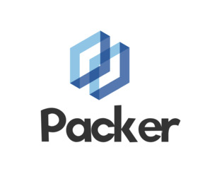

<p align="center">
  
</p>


# Packer - 轻量级 PHP Web 前端打包工具

Packer 是一个受到 Vue CLI 启发的轻量级 PHP Web 前端开发打包工具。它专为小型模板页面开发设计，能够将 HTML、CSS、JS 和图片合并为一个 HTML 文件。此外，它对 CSS 进行了兼容处理，并删除了一些不必要的文件依赖，以提高页面加载性能。

## 功能与使用场景
- 打包合并： 将所有文件打包成一个文件，减少连接和请求次数，提高请求速度。
- 模版语法支持： 支持 PHP 模版语法，可使用 {{ $key }} 在模版中输出 PHP 变量。

## 环境依赖
- PHP 版本不低于 7，且支持 pcntl 模块。
- Node.js 版本越高越好，用于使用 postcss 对 CSS 进行兼容处理。


## 快速开始
下载 Node.js 依赖:
```
npm i
```
修改 index.php:
- 在 index.php 中修改 $path 变量，指定模版路径用于预览：
```php
$path = __DIR__ . DIRECTORY_SEPARATOR . "web" . DIRECTORY_SEPARATOR . "index.html";
$liveServer = new LiveServer($path);
```

修改 packer 中的 $input 变量:
- 在 packer 中修改 $input 变量，指定需要打包的文件路径：
```php
$input = __DIR__ . DIRECTORY_SEPARATOR . "web" . DIRECTORY_SEPARATOR . "index.html";
$w = new Writer($input);
$w->compile();
```

## 启动开发模式:
```
php packer dev
```
- 在工程根目录下启动 dev 模式，实时预览。

```
php packer build
```
- 通过以下命令打包文件，可以在根目录的dist文件夹下，看到打包后的结果。对于html文件内的引用，暂时不支持外部连接。

## 模版引擎的使用
编辑 mock/Mock.php 设置需要渲染的变量：
```php
return [
    "index.html" => [
        "amount"      => "50元",
        "pay_account" => "10元",
    ],
];
```
如：我在index.html里面会渲染amount和pay_account两个数据。

## 开发规范
Web 的依赖最好只在工程目录之下，示例结构：
```
|--index.html
|--css
|-----main.css
|--js
|-----main.js
|--img
|-----1.jpg
```

## 贡献
欢迎贡献代码、报告问题或提供改进建议。我们相信您的参与将使 Packer 变得更好！


