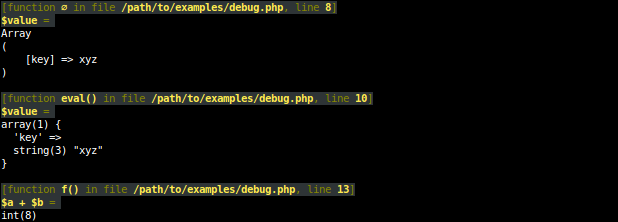

# Helpers

[](https://packagist.org/packages/geoffroy-aubry/Helpers)
[](http://travis-ci.org/geoffroy-aubry/Helpers)
[](https://coveralls.io/r/geoffroy-aubry/Helpers)

Some helpers used in several personal packages
and a `Debug` class useful for don't forgetting where debug traces are.

## Description

Two classes: 

  1. [Helpers](#desc.Helpers), 
  2. [Debug](#desc.Debug).

<a name="desc.Helpers"></a>
### 1. Helpers class

Static methods of `Helpers` class:

* [arrayMergeRecursiveDistinct](#desc.arrayMergeRecursiveDistinct)  
* [exec](#desc.exec)  
* [flattenArray](#desc.flattenArray)  
* [intToMultiple](#desc.intToMultiple)  
* [numberFormat](#desc.numberFormat)  
* [isAssociativeArray](#desc.isAssociativeArray)  
* [round](#desc.round)  
* [stripBashColors](#desc.stripBashColors)  
* [strPutCSV](#desc.strPutCSV)  
* [ucwordWithDelimiters](#desc.ucwordWithDelimiters)  
* [utf8Encode](#desc.utf8Encode)  
* [getCurrentTimeWithCS](#desc.getCurrentTimeWithCS)  
* [dateTimeToTimestamp](#desc.dateTimeToTimestamp)  
* [generateMongoId](#desc.generateMongoId)  

<a name="desc.arrayMergeRecursiveDistinct"></a>
#### arrayMergeRecursiveDistinct()
```php
/**
 * array_merge_recursive() does indeed merge arrays, but it converts values with duplicate
 * keys to arrays rather than overwriting the value in the first array with the duplicate
 * value in the second array, as array_merge does. I.e., with array_merge_recursive(),
 * this happens (documented behavior):
 *
 * array_merge_recursive(array('key' => 'org value'), array('key' => 'new value'));
 *     ⇒ array('key' => array('org value', 'new value'));
 *
 * arrayMergeRecursiveDistinct() does not change the datatypes of the values in the arrays.
 * Matching keys' values in the second array overwrite those in the first array, as is the
 * case with array_merge, i.e.:
 *
 * arrayMergeRecursiveDistinct(array('key' => 'org value'), array('key' => 'new value'));
 *     ⇒ array('key' => array('new value'));
 *
 * EVO on indexed arrays:
 *   Before:
 *     arrayMergeRecursiveDistinct(array('a', 'b'), array('c')) => array('c', 'b')
 *   Now:
 *     ⇒ array('c')
 *
 * @param array $aArray1
 * @param array $aArray2
 * @return array An array of values resulted from strictly merging the arguments together.
 * @author Daniel <daniel (at) danielsmedegaardbuus (dot) dk>
 * @author Gabriel Sobrinho <gabriel (dot) sobrinho (at) gmail (dot) com>
 * @author Geoffroy Aubry
 * @see http://fr2.php.net/manual/en/function.array-merge-recursive.php#89684
 */
public static function arrayMergeRecursiveDistinct (array $aArray1, array $aArray2);
```

<a name="desc.exec"></a>
#### exec()
```php
/**
 * Executes the given shell command and returns an array filled with every line of output from the command.
 * Trailing whitespace, such as \n, is not included in this array.
 * On shell error (exit code <> 0), throws a \RuntimeException with error message..
 *
 * @param string $sCmd shell command
 * @param string $sOutputPath optional redirection of standard output
 * @param string $sErrorPath optional redirection of standard error
 * @param bool $bAppend true to append to specified files
 * @return array array filled with every line of output from the command
 * @throws \RuntimeException if shell error
 */
public static function exec ($sCmd, $sOutputPath = '', $sErrorPath = '', $bAppend = false);
```

<a name="desc.flattenArray"></a>
#### flattenArray()
```php
/**
 * Flatten a multidimensional array (keys are ignored).
 *
 * @param array $aArray
 * @return array a one dimensional array.
 * @see http://stackoverflow.com/a/1320156/1813519
 */
public static function flattenArray (array $aArray);
```
Example:
```php
$a = array(
    1, 
    'a' => array(
        'b' => array('c', 2), 
        'd'
    )
);
print_r(Helpers::flattenArray($a));
```
⇒
```php
Array(
    [0] => 1
    [1] => 'c'
    [2] => 2
    [3] => 'd'
)
```

<a name="desc.intToMultiple"></a>
#### intToMultiple()
```php
/**
 * Returns specified value in the most appropriate unit, with that unit.
 * If $bBinaryPrefix is FALSE then use SI units (i.e. k, M, G, T),
 * else use IED units (i.e. Ki, Mi, Gi, Ti).
 * @see http://en.wikipedia.org/wiki/Binary_prefix
 *
 * @param int $iValue
 * @param bool $bBinaryPrefix
 * @return array a pair constituted by specified value in the most appropriate unit and that unit
 */
public static function intToMultiple ($iValue, $bBinaryPrefix = false);
```
Example:
```php
print_r(Helpers::intToMultiple(17825792, false));
print_r(Helpers::intToMultiple(17825792, true));
```
⇒
```php
Array(
    [0] => 17.825792
    [1] => 'M'
)
Array(
    [0] => 17
    [1] => 'Mi'
)
```

<a name="desc.numberFormat"></a>
#### numberFormat()
```php
/**
 * Format a number with grouped thousands.
 * It is an extended version of number_format() that allows do not specify $decimals.
 *
 * @param float $fNumber The number being formatted.
 * @param string $sDecPoint Sets the separator for the decimal point.
 * @param string $sThousandsSep Sets the thousands separator. Only the first character of $thousands_sep is used.
 * @param int $iDecimals Sets the number of decimal points.
 * @return string A formatted version of $number.
 */
public static function numberFormat ($fNumber, $sDecPoint = '.', $sThousandsSep = ',', $iDecimals = null);
```

<a name="desc.isAssociativeArray"></a>
#### isAssociativeArray()
```php
/**
 * Returns TRUE iff the specified array is associative.
 * Returns FALSE if the specified array is empty.
 *
 * http://stackoverflow.com/questions/173400/php-arrays-a-good-way-to-check-if-an-array-is-associative-or-sequential
 *
 * @param array $aArray
 * @return bool true ssi iff the specified array is associative
 */
public static function isAssociativeArray (array $aArray);
```

<a name="desc.round"></a>
#### round()
```php
/**
 * Rounds specified value with precision $iPrecision as native round() function, but keep trailing zeros.
 *
 * @param float $fValue value to round
 * @param int $iPrecision the optional number of decimal digits to round to (can also be negative)
 * @return string
 */
public static function round ($fValue, $iPrecision = 0);
```

<a name="desc.stripBashColors"></a>
#### stripBashColors()
```php
/**
 * Remove all Bash color sequences from the specified string.
 *
 * @param string $sMsg
 * @return string specified string without any Bash color sequence.
 */
public static function stripBashColors ($sMsg);
```

<a name="desc.strPutCSV"></a>
#### strPutCSV()
```php
/**
 * Formats a line passed as a fields array as CSV and return it, without the trailing newline.
 * Inspiration: http://www.php.net/manual/en/function.str-getcsv.php#88773
 *
 * @param array $aInput
 * @param string $sDelimiter
 * @param string $sEnclosure
 * @return string specified array converted into CSV format string
 */
public static function strPutCSV ($aInput, $sDelimiter = ',', $sEnclosure = '"');
```

<a name="desc.ucwordWithDelimiters"></a>
#### ucwordWithDelimiters()
```php
/**
 * Returns a string with the first character of each word in specified string capitalized,
 * if that character is alphabetic.
 * Additionally, each character that is immediately after one of $aDelimiters will be capitalized too.
 *
 * @param string $sString
 * @param array $aDelimiters
 * @return string
 */
public static function ucwordWithDelimiters ($sString, array $aDelimiters = array());
```
Example:
```php
echo Helpers::ucwordWithDelimiters("hel-lo wo'rld", array('-', "'"));
```
⇒
```php
"Hel-Lo Wo'Rld"
```

<a name="desc.utf8Encode"></a>
#### utf8Encode()
```php
/**
 * Returns the UTF-8 translation of the specified string, only if not already in UTF-8.
 *
 * @param string $s
 * @return string the UTF-8 translation of the specified string, only if not already in UTF-8.
 */
public static function utf8Encode ($str);
```

<a name="desc.getCurrentTimeWithCS"></a>
#### getCurrentTimeWithCS()
```php
/**
 * Returns current time with hundredths of a second.
 *
 * @param string $sFormat including %s for cs, eg: 'Y-m-d H:i:s.%s'
 * @return string current time with hundredths of a second.
 */
public static function getCurrentTimeWithCS ($sFormat);
```
Example:
```php
date_default_timezone_set('UTC');
echo Helpers::getCurrentTimeWithCS('Y-m-d H:i:s');
echo Helpers::getCurrentTimeWithCS('Y-m-d H:i:s.%s');
```
⇒
```php
2015-09-07 21:56:06
2015-09-07 21:56:06.579394
```

<a name="desc.dateTimeToTimestamp"></a>
#### dateTimeToTimestamp()
```php
/**
 * Returns 'Y-m-d H:i:s[.cs]' date to timestamp, where '.cs' stands for optional hundredths of a second.
 *
 * @param string $sDate at format 'Y-m-d H:i:s[.cs]'
 * @return float 'Y-m-d H:i:s[.cs]' date to timestamp, where '.cs' stands for optional hundredths of a second.
 */
public static function dateTimeToTimestamp ($sDate);
```
Example:
```php
date_default_timezone_set('UTC');
echo Helpers::dateTimeToTimestamp('2015-09-07 00:00:00');
echo Helpers::dateTimeToTimestamp('2015-09-07 00:00:00.12');
```
⇒
```php
1441584000
1441584000.12
```

<a name="desc.generateMongoId"></a>
#### generateMongoId()
```php
/**
 * Generates a globally unique id generator using Mongo Object ID algorithm.
 *
 * The 12-byte ObjectId value consists of:
 * - a 4-byte value representing the seconds since the Unix epoch,
 * - a 3-byte machine identifier,
 * - a 2-byte process id, and
 * - a 3-byte counter, starting with a random value.
 * @see https://docs.mongodb.org/manual/reference/method/ObjectId/
 *
 * Uses SKleeschulte\Base32 because base_convert() may lose precision on large numbers due to properties related
 * to the internal "double" or "float" type used.
 * @see http://php.net/manual/function.base-convert.php
 *
 * @param  int    $iTimestamp Default: time()
 * @param  bool   $bBase32 Base32 (RFC 4648) or hex output?
 * @return string 20 base32-char or 24 hex-car MongoId.
 *
 * @see https://www.ietf.org/rfc/rfc4648.txt
 * @see http://stackoverflow.com/questions/14370143/create-mongodb-objectid-from-date-in-the-past-using-php-driver
 */
public static function generateMongoId ($iTimestamp = 0, $bBase32 = true);
```
Example:
```php
var_dump(generateMongoId());
var_dump(generateMongoId(time()));
var_dump(generateMongoId(time(), false));
```
⇒
```php
string(20) "k34hekzumvsqs2ycyaoa"
string(20) "k34hekzumvsqs2ycyaoq"
string(24) "56f8722b346565096b02c01e"
```


<a name="desc.Debug"></a>
### 2. Debug class

Debug class useful for don't forgetting where debug traces are.

Automatically decorates `print_r()` and `var_dump()` with following information:
  * file and line of the caller
  * name of function/method containing the call
  * name of the parameter passed during call

#### Demo

See [debug.php](examples/debug.php) script for an example:
```bash
$ php examples/debug.php
```

Here is the result:



#### htmlVarDump()
```php
/**
 * Display an HTML trace containing a var_dump() of the specified value.
 *
 * @param mixed $mValue value to pass to var_dump()
 */
public static function htmlVarDump ($mValue);
```
    
#### htmlPrintr()
```php
/**
 * Display an HTML trace containing a print_r() of the specified value.
 *
 * @param mixed $mValue value to pass to print_r()
 */
public static function htmlPrintr ($mValue);
```

#### printr()
```php
/**
 * Display a CLI trace containing a print_r() of the specified value.
 *
 * @param mixed $mValue value to pass to print_r()
 */
public static function printr ($mValue);
```

#### varDump()
```php
/**
 * Display a CLI trace containing a var_dump() of the specified value.
 *
 * @param mixed $mValue value to pass to var_dump()
 */
public static function varDump ($mValue);
```

## Usage

**Helpers** is available via [Packagist](https://packagist.org/packages/geoffroy-aubry/helpers).

1. Class autoloading and dependencies are managed by [Composer](http://getcomposer.org/) 
so install it following the instructions 
on [Composer: Installation - *nix](http://getcomposer.org/doc/00-intro.md#installation-nix)
or just run the following command:
```bash
$ curl -sS https://getcomposer.org/installer | php
```

2. Add dependency to `GAubry\Helpers` into require section of your `composer.json`:
```json
    {
        "require": {
            "geoffroy-aubry/helpers": "1.*"
        }
    }
```
and run `php composer.phar install` from the terminal into the root folder of your project.

3. Include Composer's autoloader and use the `GAubry\Helpers` classes:
```php
    <?php
    
    require_once 'vendor/autoload.php';
    use GAubry\Helpers\Helpers;
    use GAubry\Helpers\Debug;
    
    Helpers::exec('ls -l /var/log');
    Debug::printr($value);
    …
```

## Documentation
[API documentation](http://htmlpreview.github.io/?https://github.com/geoffroy-aubry/Helpers/blob/stable/doc/api/index.html) 
is generated by [ApiGen](http://apigen.org/) in the `doc/api` folder.

```bash
$ php vendor/bin/apigen.php -c apigen.neon
```

## Copyrights & licensing
Licensed under the GNU Lesser General Public License v3 (LGPL version 3).
See [LICENSE](LICENSE) file for details.

## Change log
See [CHANGELOG](CHANGELOG.md) file for details.

## Continuous integration

[](http://travis-ci.org/geoffroy-aubry/Helpers)
[](https://coveralls.io/r/geoffroy-aubry/Helpers)

Following commands are executed during each build and must report neither errors nor warnings:

 * Unit tests with [PHPUnit](https://github.com/sebastianbergmann/phpunit/):

    ```bash
    $ php vendor/bin/phpunit --configuration phpunit.xml
    ```

 *  Coding standards with [PHP CodeSniffer](http://pear.php.net/package/PHP_CodeSniffer):

    ```bash
    $ php vendor/bin/phpcs --standard=PSR2 src/ tests/ -v
    ```

 *  Code quality with [PHP Mess Detector](http://phpmd.org/):

    ```bash
    $ php vendor/bin/phpmd src/ text codesize,design,unusedcode,naming,controversial
    ```

## Git branching model
The git branching model used for development is the one described and assisted by `twgit` tool: [https://github.com/Twenga/twgit](https://github.com/Twenga/twgit).
