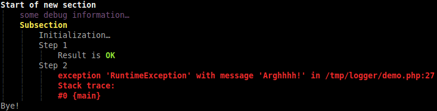

# Colored and Indented Logger

[](https://packagist.org/packages/geoffroy-aubry/Logger)
[](http://travis-ci.org/geoffroy-aubry/Logger)
[](https://coveralls.io/r/geoffroy-aubry/Logger)
 
[PSR-3](https://github.com/php-fig/fig-standards/blob/master/accepted/PSR-3-logger-interface.md)
logger for adding colors and indentation on PHP CLI output.

## Description
Use tags and placeholder syntax to provide an easy way to color and indent PHP CLI output.
[PSR-3](https://github.com/php-fig/fig-standards/blob/master/accepted/PSR-3-logger-interface.md) compatibility 
allows graceful degradation when switching to another PSR-3 compliant logger.

### Colors
1. Declare some colors:
```php
    $aConfig = array(
        'colors' => array(
            'debug'      => "\033[0;35m",
            'error'      => "\033[1;31m",
            'section'    => "\033[1;37m",
            'subsection' => "\033[1;33m",
            'ok'         => "\033[1;32m"
        )
    );
    $oLogger = new ColoredIndentedLogger($aConfig);
```

2. Use them either by exploiting placeholder syntax with `'C.'` prefix:
```php
    $oLogger->info('{C.section}Start of new section');
    $oLogger->info('Result is {C.ok}OK');
```
Or by logging message with a level equals to a color key:
```php
    $oLogger->debug('some debug information…');
    $oLogger->error(new \RuntimeException('Arghhhh!'));
```
It is even possible to specify color tag in the value of a placeholder:
```php
    $oLogger->info('Result is {result}', array('result' => '{C.ok}OK'));
```

*See below for demonstration.*

### Indentation
You can control indentation level with indent and unindent tags:

  * default tags are `'+++'` and `'---'`,
  * both usable at the beginning or at the end of any message,
  * one or more occurrences,
  * can be used alone.

Example: 
```php
$oLogger->info('Section A+++');
$oLogger->info('Subsection+++');
$oLogger->info('Step 1');
$oLogger->info('Step 2');
$oLogger->info('------Section B+++');
```

*See below for demonstration.*

### Configuration
Default configuration:
```php
array(
    'colors'               => array(),
    'base_indentation'     => "\033[0;30m┆\033[0m   ",
    'indent_tag'           => '+++',
    'unindent_tag'         => '---',
    'min_message_level'    => \Psr\Log\LogLevel::DEBUG,
    'reset_color_sequence' => "\033[0m",
    'color_tag_prefix'     => 'C.'
);
```

Where:

  * `colors`           ⇒ `(array)` Array of key/value pairs to associate bash color codes to color tags (see above).
  * `base_indentation`     ⇒ `(string)` Describe what is a simple indentation, e.g. `"\t"`.
  * `indent_tag`           ⇒ `(string)` Tag usable at the start or at the end of the message to add one or more indentation level.
  * `unindent_tag`         ⇒ `(string)` Tag usable at the start or at the end of the message to remove one or more indentation level.
  * `min_message_level`    ⇒ `(string)` Threshold required to log message, must be defined in `\Psr\Log\LogLevel`.
  * `reset_color_sequence` ⇒ `(string)` Concatenated sequence at the end of message when colors are used. For example: `"\033[0m"`.
  * `color_tag_prefix`     ⇒ `(string)` Prefix used in placeholders to distinguish standard context from colors.

### Demo

See [demo.php](examples/demo.php) script for an example:
```bash
$ php examples/demo.php
```

Here is the result:



## Usage

1. Class autoloading and dependencies are managed by [Composer](http://getcomposer.org/) 
so install it following the instructions 
on [Composer: Installation - *nix](http://getcomposer.org/doc/00-intro.md#installation-nix)
or just run the following command:
```bash
$ curl -sS https://getcomposer.org/installer | php
```

2. Add dependency to `GAubry\Logger` into require section of your `composer.json`:
```json
    {
        "require": {
            "geoffroy-aubry/logger": "1.*"
        }
    }
```
and run `php composer.phar install` from the terminal into the root folder of your project.

3. Include Composer's autoloader and use the `GAubry\Logger` class:
```php
    <?php
    
    require_once 'vendor/autoload.php';
    use GAubry\Logger\ColoredIndentedLogger;
    
    $aConfig = array(…);
    $oLogger = new ColoredIndentedLogger($aConfig);
    
    $oLogger->info('Hello');
    …
```

## Documentation
[API documentation](http://htmlpreview.github.io/?https://github.com/geoffroy-aubry/Logger/blob/stable/doc/api/index.html) generated by [ApiGen](http://apigen.org/) 
and included in the `doc/api` folder.

## Copyrights & licensing
Licensed under the GNU Lesser General Public License v3 (LGPL version 3).
See [LICENSE](LICENSE) file for details.

## Change log
See [CHANGELOG](CHANGELOG.md) file for details.

## Continuous integration

[](http://travis-ci.org/geoffroy-aubry/Logger)
[](https://coveralls.io/r/geoffroy-aubry/Logger)

Following commands are executed during each build and must report neither errors nor warnings:

 * Unit tests with [PHPUnit](https://github.com/sebastianbergmann/phpunit/):

    ```bash
    $ php vendor/bin/phpunit --configuration phpunit.xml
    ```

 *  Coding standards with [PHP CodeSniffer](http://pear.php.net/package/PHP_CodeSniffer):

    ```bash
    $ php vendor/bin/phpcs --standard=PSR2 src/ tests/ -v
    ```

 *  Code quality with [PHP Mess Detector](http://phpmd.org/):

    ```bash
    $ php vendor/bin/phpmd src/ text codesize,design,unusedcode,naming,controversial
    ```

## Git branching model
The git branching model used for development is the one described and assisted by `twgit` tool: [https://github.com/Twenga/twgit](https://github.com/Twenga/twgit).
